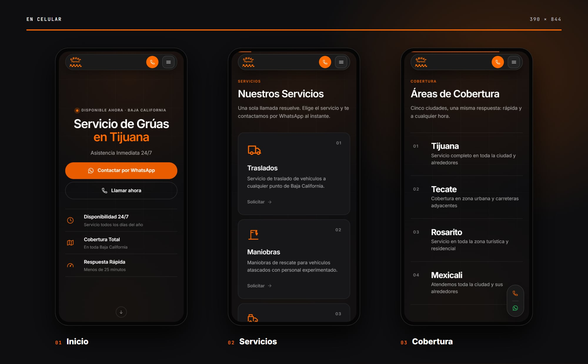

  

<h1 align="center">Grúas Higareda</h1>

<b>Servicio de grúas 24/7 en Baja California</b>

  
  
  
  

## Sobre el proyecto

Landing de **Grúas Higareda**, servicio de grúas 24/7 en Tijuana, Tecate, Rosarito, Mexicali y Ensenada. Rediseño con enfoque en contacto inmediato: llamada y WhatsApp siempre a la mano, tiempo de llegada de menos de 25 minutos y precios desde $800 MXN. El sitio está en español y en inglés.

Es un sitio estático, hecho con HTML, CSS y JavaScript, sin frameworks ni proceso de build.

## Secciones

| Sección | Contenido |
| --- | --- |
| **Inicio** | Disponibilidad 24/7, cobertura en todo Baja California y respuesta en menos de 25 minutos |
| **Servicios** | Traslados, maniobras, servicio pesado, abastecimiento de gasolina, pase de corriente y cambio de llanta |
| **Galería** | La flota trabajando en carretera y ciudad |
| **Cobertura** | Tijuana, Tecate, Rosarito, Mexicali y Ensenada |
| **Contacto** | Llamada y WhatsApp con el servicio ya elegido |

## En computadora

  

## En celular

  

## Tecnologías

- HTML5, CSS3 y JavaScript.
- Diseño adaptable a celular, tableta y computadora.
- Íconos SVG en línea, sin librerías externas.
- Tipografía de Google Fonts: Inter.
- Versión en español y en inglés, enlazadas con `hreflang`.
- SEO técnico: datos estructurados de negocio local con sus servicios, `robots.txt` y `sitemap.xml`.

## Créditos

Desarrollado por Salereee. Logotipos, fotografías y textos del negocio pertenecen a Grúas Higareda.
