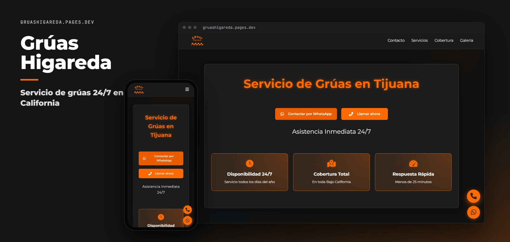
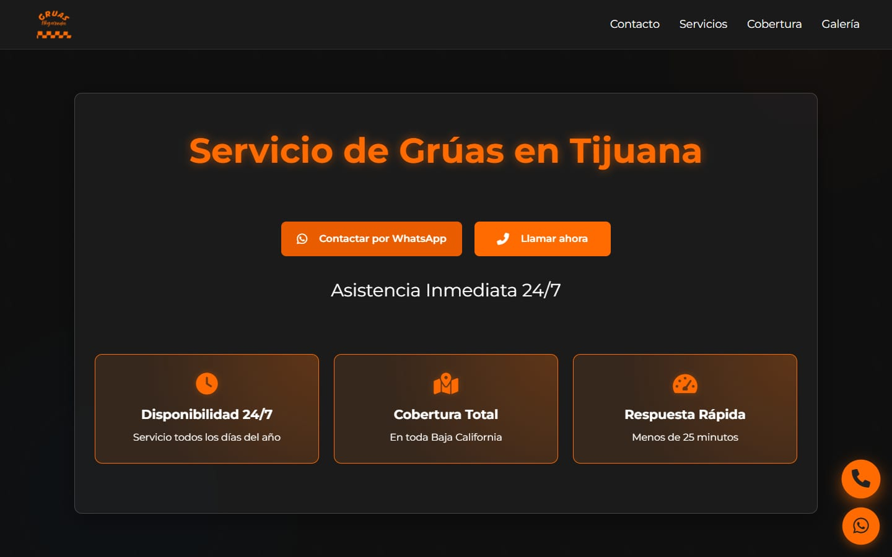
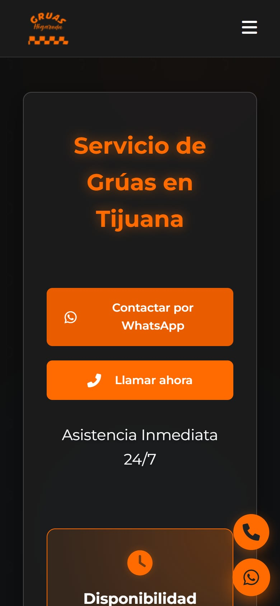

<p align="center">
  
</p>

<h1 align="center">Grúas Higareda</h1>

<p align="center"><b>Servicio de grúas 24/7 en Baja California</b></p>

<p align="center">
  <a href="https://gruashigareda.pages.dev/"><b>Ver el sitio →</b></a><br><br>
  
  
  
  
</p>

## Sobre el proyecto

Landing de **Grúas Higareda**: servicio de grúas 24/7 en Tijuana, Tecate, Rosarito, Mexicali y Ensenada, con traslados, maniobras y servicio pesado.

Es un sitio estático: HTML, CSS y JavaScript sin frameworks ni proceso de build.

## Secciones

| Sección | Contenido |
| --- | --- |
| **Contacto** | WhatsApp y llamada inmediata |
| **Servicios** | Tipos de servicio |
| **Cobertura** | Ciudades de Baja California |
| **Galería** | Galería de fotos |

## Capturas

<p align="center">
  
  &nbsp;
  
</p>

## Tecnologías

- HTML5, CSS3 y JavaScript, sin frameworks ni proceso de build.
- Íconos de [Font Awesome](https://fontawesome.com/) (desde CDN).
- Tipografía de Google Fonts (Montserrat).
- Diseño adaptable a celular, tableta y computadora.
- Publicado en **Cloudflare Pages**.

## Estructura

```
GruasHigareda/
├── docs/                       # Imágenes de este README
├── Imagenes/
├── index.html                  # Página principal
├── Logo.ico
├── Logo.png
├── script.js                   # Interacciones (menú, animaciones)
└── styles.css                  # Estilos
```

## Correr en local

No necesita instalar nada. Abre `index.html` en el navegador, o sírvelo desde la carpeta del repo:

```bash
python -m http.server 8000
```

y entra a <http://localhost:8000>.

## Créditos

Desarrollado por [@Salereee](https://github.com/Salereee). Logotipos, fotografías y textos del negocio pertenecen a Grúas Higareda.
